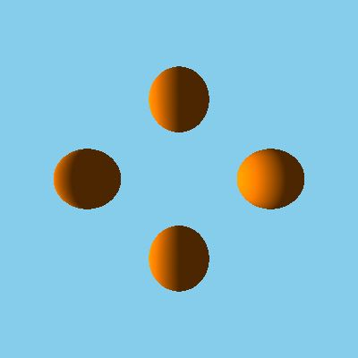
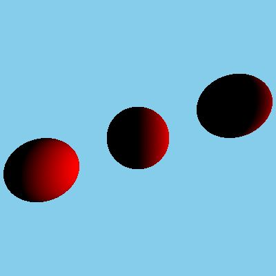

# C-Ray-on
A 3-D Ray Tracer built using C which relies on Lambertian Reflectance Model to illuminate objects.
Currently only sphere is supported, but more shapes to be added soon.
Fast Approximate Anti-Aliasing (FXAA) supported.

## Usage
Built using C11 on Windows but should also run on Linux.
Run `make`.

## Outputs
### Before/After applying FXAA Post-Processing

  
  

### Light on the face, non-overlapping

### Light on the right side, non-overlapping

### Light on the left side, non-overlapping

### Light on the right side, overlapping

